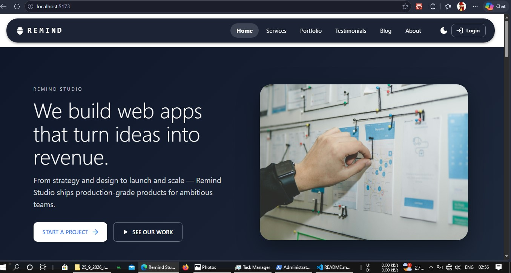
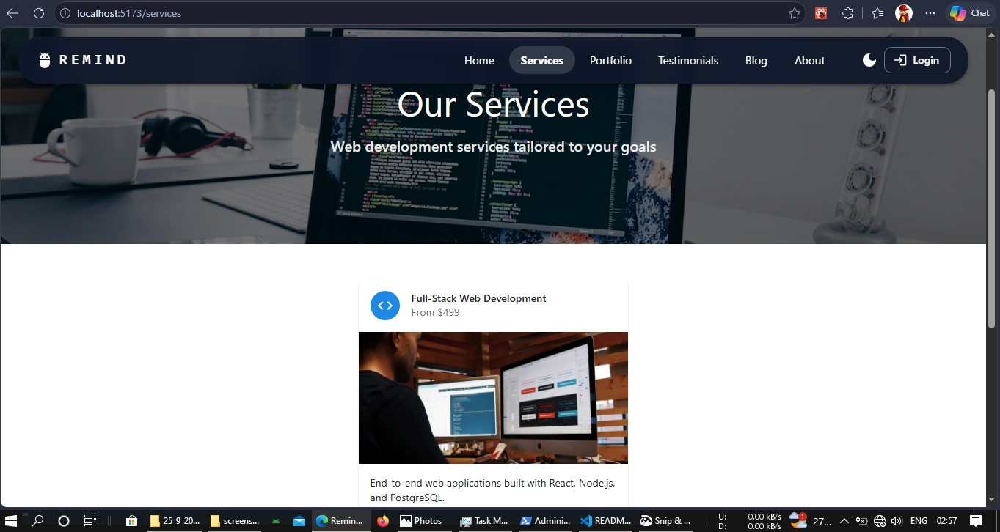
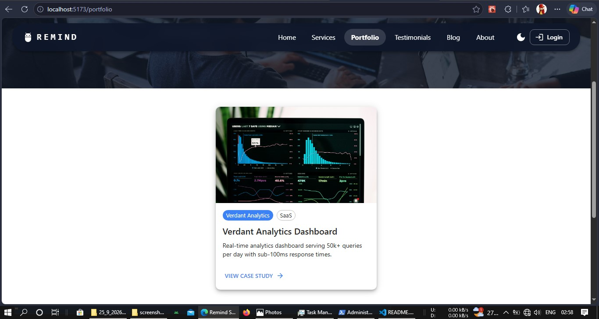
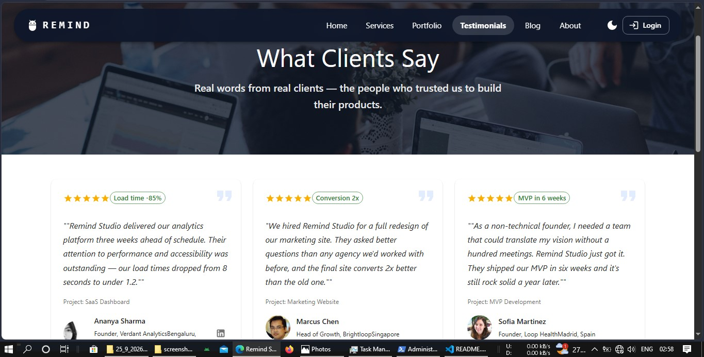
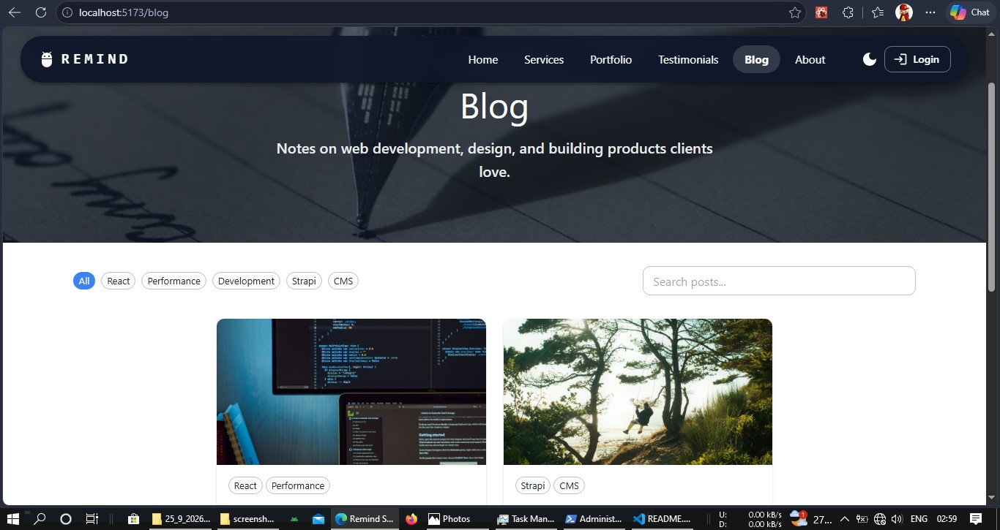
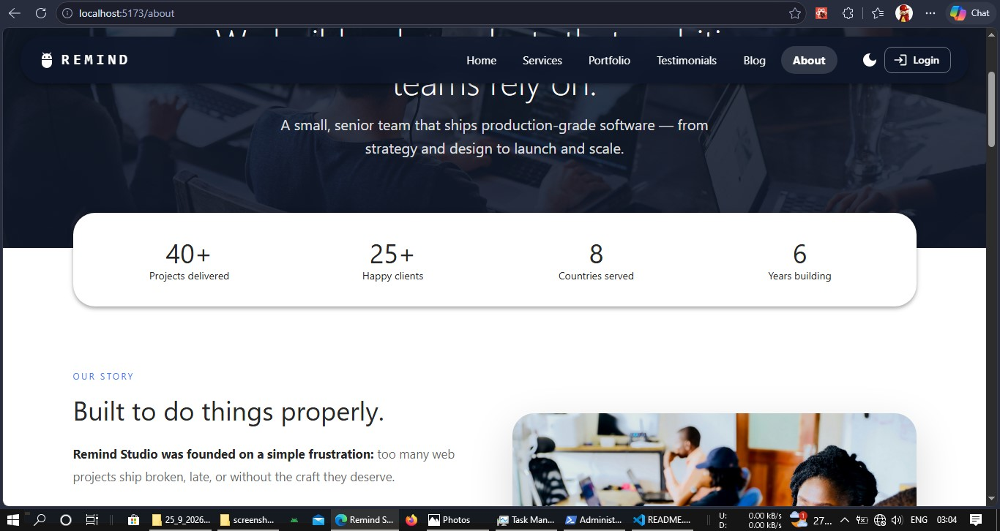

<!-- @format -->

# ⚡ Vite + React Project

A blazing-fast, modern frontend application built with **Vite** and **React**. This project leverages Vite's lightning-quick HMR (Hot Module Replacement) and React's component-based architecture to deliver a smooth developer experience and a production-ready app.

<p align="center">
  
</p>

---

## 📋 Table of Contents

- [Features](#-features)
- [Tech Stack](#-tech-stack)
- [Prerequisites](#-prerequisites)
- [Getting Started](#-getting-started)
  - [Step 1: Clone the Repository](#step-1-clone-the-repository)
  - [Step 2: Install Dependencies](#step-2-install-dependencies)
  - [Step 3: Configure Environment Variables](#step-3-configure-environment-variables)
  - [Step 4: Run the Development Server](#step-4-run-the-development-server)
  - [Step 5: Build for Production](#step-5-build-for-production)
- [Project Structure](#-project-structure)
- [Available Scripts](#-available-scripts)
- [Environment Variables](#-environment-variables)
- [Deployment](#-deployment)
- [Troubleshooting](#-troubleshooting)
- [Contributing](#-contributing)
- [License](#-license)

---

## ✨ Features

- ⚡ **Lightning-fast HMR** powered by Vite
- ⚛️ **React 18** with modern hooks & concurrent features
- 🎨 **Tailwind CSS** (or your styling solution) for rapid UI development
- 🧭 **React Router** for client-side routing
- 📦 **Optimized production builds** with tree-shaking & code-splitting
- 🔐 **Environment variables** support via `.env`
- 🧹 **ESLint + Prettier** for consistent code quality
- 📱 **Fully responsive** design

---

## 🛠 Tech Stack

| Category           | Technology                                             |
| ------------------ | ------------------------------------------------------ |
| ⚡ Build Tool      | [Vite](https://vitejs.dev/)                            |
| ⚛️ Framework       | [React 18](https://react.dev/)                         |
| 🧭 Routing         | [React Router v6](https://reactrouter.com/)            |
| 🎨 Styling         | [Tailwind CSS](https://tailwindcss.com/) / CSS Modules |
| 🌐 HTTP Client     | [Axios](https://axios-http.com/) / Fetch API           |
| 🧹 Linting         | ESLint + Prettier                                      |
| 📦 Package Manager | npm / yarn / pnpm                                      |

---

## ✅ Prerequisites

Before you begin, ensure you have the following installed:

| Tool    | Version               | Download                            |
| ------- | --------------------- | ----------------------------------- |
| Node.js | v18.x or v20.x        | [nodejs.org](https://nodejs.org/)   |
| npm     | v9+ (comes with Node) | —                                   |
| Git     | Latest                | [git-scm.com](https://git-scm.com/) |

> 💡 Verify your installations:
>
> ```bash
> node -v
> npm -v
> git --version
> ```


---

## 🏁 Getting Started

Follow these steps to get your Vite + React app running locally in **under 2 minutes**.

### Step 1: Clone the Repository

```bash
git clone https://github.com/your-username/your-vite-react-app.git
cd your-vite-react-app

# React + Vite

This template provides a minimal setup to get React working in Vite with HMR and some ESLint rules.

Currently, two official plugins are available:

- [@vitejs/plugin-react](https://github.com/vitejs/vite-plugin-react/blob/main/packages/plugin-react) uses [Oxc](https://oxc.rs)
- [@vitejs/plugin-react-swc](https://github.com/vitejs/vite-plugin-react/blob/main/packages/plugin-react-swc) uses [SWC](https://swc.rs/)

## React Compiler

The React Compiler is enabled on this template. See [this documentation](https://react.dev/learn/react-compiler) for more information.

Note: This will impact Vite dev & build performances.
You can also try [the experimental native React Compiler support in plugin-react](https://github.com/vitejs/vite-plugin-react/blob/main/packages/plugin-react/README.md#rust-react-compiler) by using `compiler: true` in the plugin options instead of using the Babel plugin.

## Expanding the ESLint configuration

If you are developing a production application, we recommend using TypeScript with type-aware lint rules enabled. Check out the [TS template](https://github.com/vitejs/vite/tree/main/packages/create-vite/template-react-ts) for information on how to integrate TypeScript and [`typescript-eslint`](https://typescript-eslint.io) in your project.
```

You should see output like:

text
VITE v5.x.x ready in 250 ms

➜ Local: http://localhost:5173/
➜ Network: use --host to expose
➜ press h + enter to show help

Open http://localhost:5173 in your browser

and you see like this








your .env file must contain

---

VITE_EMAILJS_SERVICE_ID=(your email service id )
VITE_EMAILJS_TEMPLATE_ID=(your email service template id )
VITE_EMAILJS_PUBLIC_KEY=(your email service public id )
VITE_PAYPAL_CLIENT_ID= (your paypal triel account id )
VITE_PAYPAL_ENVIRONMENT=sandbox

---
